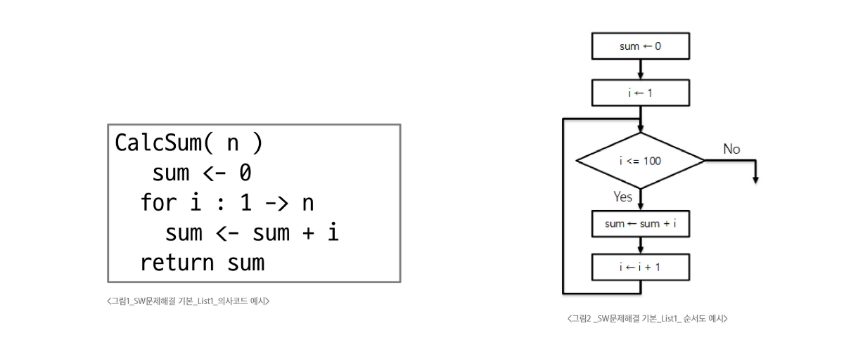
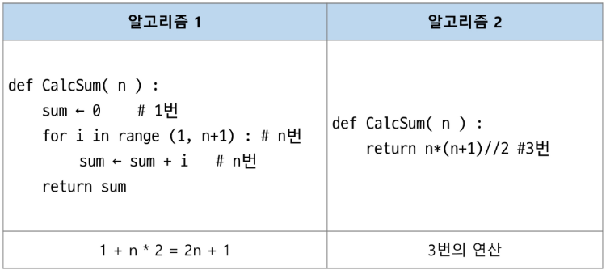
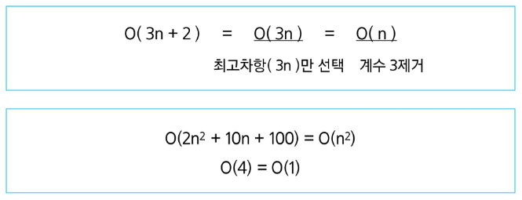

# Algorithm

## 알고리즘
- 문제를 해결하기 위한 절차 or 방법

### 알고리즘의 성능
- 좋은 알고리즘
    - 정확성: 얼마나 정확하게 동작
    - 작업량: 적은 연산으로 원하는 결과
    - 메모리 사용량: 적은 메모리 사용
    - 단순성
    - 최적성: 개선할 여지없이 최적화

### 의사코드(슈도코드, Pseudocode)와 순서도
- 컴퓨터 분야에서 알고리즘을 표현하는 방법



#### 알고리즘의 시간 복잡도
- 알고리즘의 작업량을 표현할 때 시간 복잡도로 표현

##### 시간 복잡도
- 실제 걸리는 시간을 측정
- 실행되는 명령문의 개수를 계산



##### 시간 복잡도 표시
- 빅-오 표기법 언급하는 경우가 많음
- 시간 복잡도 함수 중 가장 큰 영향력을 주는 n에 대한 항만을 표시
- 계수는 생략하여 표시  




### 배열
- 일정한 자료형의 변수들을 하나의 이름으로 열거하여 사용하는 자료 구조

#### 배열의 필요성 
- 프로그램 내에서 여러 개의 변수가 필요할 때
    - 일일히 다른 변수명을 이용하여 자료에 접근하는 것은 매우 비효율 적
- 배열을 사용하면 하나의 선언을 통해 둘 이상의 변수를 선언
- 단순히 다수의 변수 선언을 의미하는 것이 아님

##### 1차원 배열
- 배열을 선언할 때 프로그램에서 사용할 배열의 이름 필요
```python
# 1차원 배열 선언의 예시
arr = list()
arr = []
arr = [0]*10
arr = [1, 2, 3]

# 1차원 배열 접근의 예시
arr[0] = 10
arr[idx] = 20
```
- 입력 받은 정수를 1차원 배열에 저장하는 방법
```python
N = int(input()) # 리스트에 저장할 개수
arr = list(map(int, input().split()))

# 입력 예시
6
2 7 5 3 1 4 -> 공백을 기준으로 나누기
```
#### 알고리즘 예시
```python
# 배열 원소 중 최댓값의 인덱스 max_idx 찾기

max_idx = 0 # 첫 원소를 최대로 가정

for i in range(1, N):
    if arr[max_idx] < arr[i]:
        max_idx = i
```
```python
# 찾는 값이 배열에 있으면 해당 원소의 인덱스 출력, 없으면 -1

N, V = map(int,input().split())
arr = list(map(int,input().split()))

idx = -1
for i in range(N):
    if arr[i] == V:
        idx = i
        break
```

### 연습문제
```python
# Test Case, N, arr 구현 예시

# 최대, 최소의 차 구하기
T = int(input())
for tc in range(1,T+1):
    N = int(input())
    arr = list(map(int, input().split()))
    max_num = arr[0]
    min_num = arr[0]
    #코드 구현
    
    print(f'#{tc} {max_num - min_num}')

# 연습문제 2번
# 상자들이 쌓여있는 방에서 방이 오른쪽으로 90도 회전하여 상자들이 중력의 영향을 받아 낙하, 낙차가 가장 큰 상자 구하기
-> arr에서 오른쪽에 있는 원소 중 자신보다 작은 값들 중 max 값
-> 생각하는 방법이 중요
```
### 정렬
- 2개 이상의 자료를 키(특정 기준)에 의해 작은 값부터 큰 값, 혹은 그 반대의 순서대로 재배열하는 알고리즘

#### 정렬의 종류
- 버블 정렬
- 퀵 정렬
- 카운팅 정렬
- 삽입 정렬
- 선택 정렬
- 병합 정렬

##### 버블 정렬
- 인접한 두 개의 원소를 비교하며 자리를 계속 교환하는 방식

###### 버블 정렬 과정 -> 오름차순
1. 첫 번째 원소부터 인접한 원소끼리 계속 자리를 교환하면서 맨 마지막 자리까지 이동
2. 한 단계가 끝나면 가장 큰 원소가 마지마 자리로 정렬

- 시간 복잡도 -> O(n^2)

###### 버블 정렬 과정 예시
```python
[55, 7, 78, 12, 42]를 버블 정렬하는 과정(오름차순)

def bubble_sort(a, N): # 정렬할 List, N 원소 수
    for i in range(N-1, 0, -1): # 범위의 끝 위치
        for j in range(i): # 비교할 왼쪽 원소 인덱스 j
            if a[j]>a[j+1]:
                a[j], a[j+1] = a[j+1], a[j]
```


