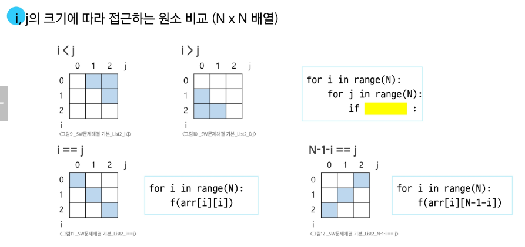
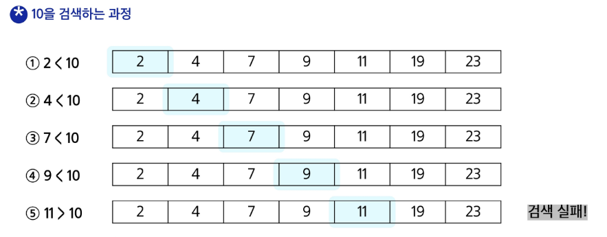
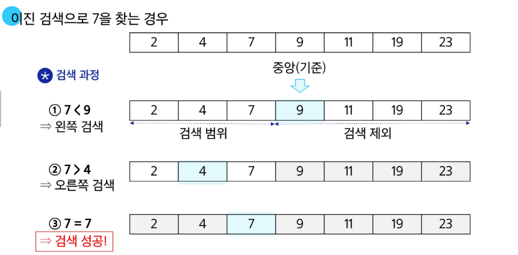
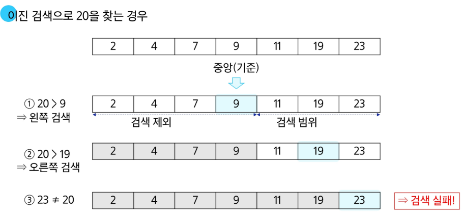

# SW 문제해결 기본

## 2차원 List

### 2차원 배열
- 2차원 배열의 선언
    - 1차원 list를 묶어놓은 list
    - 2차원 이상의 다차원 list는 차원에 따라 index를 선언
    - 2차원 list의 선언: 세로 길이(행의 개수), 가로 길이(열의 개수)를 필요로 함
    - python에서는 데이터 초기화를 통해 변수 선언과 초기화가 가능함

#### 입력을 2차원 배열에 저장하기
```python
# 입력 예시
# 3
# 1 2 3
# 4 5 6
# 7 8 9

N = int(input())
arr = [list(map(int, input().split())) for _ in range(N)]

값을 붙여서 주면
arr = [list(map(int, input())) for _ in range(N)]

0으로 이루어진 3 X 4 배열 만들기
arr = [[0] * 4 for _ in range(3)]
```

#### 배열 순회
- n X m 배열의 n*m 개의 모든 원소를 빠짐없이 조사하는 방법(n: 행, m: 열)

```python
행 우선 순회 예시
# i 행의 좌표
# j 열의 좌표

n, m = map(int, input().split())
arr = [list(map(int, input().split())) for _ in range(n) ]

s = 0
for i in range(n):
    for j in range(m):
        s += arr[i][j] # 필요한 연산 수행

열 우선 순회 예시
# 열의 합 중 최대

max_v = 0
for j in range(m):
    s = 0
    for i in range(n):
        s += arr[i][j]
    if s>max_v:
        max_v = s

지그재그 순회

for i in range(n):
    for j in range(m):
        f(arr[i][j + (m-1-2*j)*(i%2)])
```

### 델타
- 2차 배열의 한 좌표에서 4방향의 인접 배열 요소를 탐색하는 방법
- 인덱스 (i, j)인 칸의 상하좌우 칸 (ni, nj)

```python
# N X N 배열에서 각 원소를 중심으로, 상하좌우 k칸의 합계 중 최댓값 (k = 2)

max_v = 0
for i in range(N):
    for j in range(N):
        s = arr[i][j]
        for di, dj in [[0, 1], [1, 0], [0, -1], [-1, 0]]: # 각 방향
            for c in range(1, k+1): # 거리별
                ni, nj = i+di*c, j+dj*c
                if 0 <= ni < N and 0 <= nj < N:
                    s += arr[ni][nj]
        if max_v < s:
            max_v = s
```

#### 전치 행렬
- 대칭되는 행렬
```python
# i : 행의 좌표, 행의 크기 len(arr)
# j : 열의 좌표, 열의 크기 len(arr[0])
arr = [[1, 2, 3], [4, 5, 6], [7, 8, 9]] # 3X3 행렬

for i in range(3):
    for j in range(3):   # for j in range(i)인 경우 if문 필요 없음
        if i<j:
            arr[i][j], arr[j][i] = arr[j][i], arr[i][j]


# 대각선의 합

n = int(input())
arr = []
s = 0
for i in range(n):
    s += arr[i][i]
    s =- arr[i][n-1-i]
    if n%2 == 1:
        s -= arr[(n-1)/2][(n-1)/2]
```


### 부분집합

- 비트 연산자
    - &: 비트 단위로 AND 연산
    - |: 비트 단위로 or 연산
    - <<: 피연산자의 비트 열을 왼쪽으로 이동
    - >>: 피연산자의 비트 열을 오른쪽으로 이동
- <<연산자 활용
    - 1<<n: 2^n 즉, 원소가 n개일 경우의 모든 부분집합의 수를 의미
- &연산자 활용
    - i & (1<<j): i의 j번째 비트가 1인지 아닌지를 검사
```python
# 부분집합 구하기 -> 이해 잘 안되므로 나중에 이해 요망
# 비트 연산을 사용

arr = [3,6,7,1,5,4]
n = len(arr)
for i in range(1<<n): # 1<<n : 부분 집합의 개수, range(1, 1<<n) -> 공집합 제외
    for j in range(n):  # 원소의 수만큼 비트를 비교
        if i & (1<<j):  # i의 j번 비트가 1인 경우
            print(arr[j], end = ",") # j번 원소 출력
    print()

arr = [1, 2, 3, 4]
bit = [0, 0, 0, 0]
for i in range(2):
    bit[0] = i
    for j in range(2):
        bit[1] = j

         식으로 가능
```

## 검색
- 저장되어 있는 자료 중에서 원하는 항목을 찾는 작업
- 목적하는 탐색 키를 가진 항목을 찾는 것

### 순차 검색
- 일렬로 되어 있는 자료를 순서대로 검색
    - 가장 간단하고 직관적인 검색 방법
    - 배열이나 연결 리스트 등 순차 구조로 구현된 구조에서 원하는 항목 찾을 때 유용
    - 알고리즘이 단순하여 구현이 쉽지만, 검색 대상 수가 많은 경우 수행시간이 급격히 증가하여 비효율적
- 정렬 여부에 따라
#### 순차 검색 대상이 정렬되어 있지 않은 경우
1. 첫 번째 원소부터 순서대로 검색 대상과 키 값이 같은 원소가 있는지 비교하며 찾음
2. 키 값이 동일한 원소를 찾으면 그 원소의 인덱스 반환
3. 자료구조의 마지막에 이를 때까지 검색 대상을 찾지 못하면 검색 실패

- 찾고자 하는 원소의 순서에 따라 비교 횟수가 결정됨
    - ex) 3번째 원소를 찾기 위해서는 3번의 비교가 필요


#### 순차 검색 대상이 정렬되어 있는 경우
1. 자료가 오름차순으로 정렬된 상태에서 검색을 실시
2. 자료를 순차적으로 검색하면서 키 값을 비교하여, 원소의 키 값이 검색 대상의 키 값보다 크면 찾는 원소가 없다는 것 -> 검색 종료


- 찾고자 하는 원소에 순서에 따라 비교 횟수가 결정됨
    - 정렬이 되어있으므로, 검색 실패를 반환하는 경우에도 평균 비교 횟수가 반으로 줄어듦
```python
def sequential_search(a, key):
    i = 0
    while i < len(a) and a[i] < key:
        i += 1
    if i < len(a) and a[i] == key:
        return i
    else:
        return -1

def sequential_search(a, key):
    for i in range(len(a)):
        if a[i] == key:
            return i
        elif a[i] > key:
            return -1
    return -1
```

### 이진 검색
- 자료의 가운데에 있는 항목의 키 값과 비교하여 다음 검색의 위치를 결정하고 검색을 계속 진행하는 방법
    -  목적 키를 찾을 때까지 이진 검색을 순환적으로 반복 수행함으로써
    - 검색 범위를 반으로 줄여가면서 보다 빠르게 검색 수행
- 이진 검색을 하기 위해서는 자료가 정렬된 상태여야 함

#### 검색 과정
1. 자료의 중앙에 있는 원소를 고름
2. 중앙 원소의 값과 찾고자 하는 목표 값을 비교
3. 목표 값이 중앙 원소의 값보다 작으면 자료의 왼쪽 반에 대해서 검색 수행, 크면 오른쪽 반에 대해서 검색 수행
4. 찾고자 하는 값을 찾을 때 까지 1~3 과정 반복




```python
# while 문 사용

def binary_search(a, key):
    start = 0
    end = len(a)
    while start <= end:
        middle = (start + end)//2
        if a[middle] == key:
            return middle
        elif a[middle] > key:
            end = middle - 1 # 찾는 값보다 크면 왼쪽 구간
        else:
            start = middle + 1 #찾는 값보다 작으면 오른쪽 구간
    return -1

# 재귀함수 사용

def binary_search(a, low, high, key):
    if low > high: # 검색 실패
        return False
    else:
        middle = (low + high) // 2
        if key == a[middle] # 검색 성공
            return True
        elif key < a[middle]:
            return binary_search(a, low, middle-1, key)
        elif a[middle] < key:
            return binary_search(a, middle+1, high, key)
```

### 선택 정렬
- 주어진 자료들 중 가장 작은 값의 원소부터 차례대로 선택하여 위치를 교환하는 방식(오름차순의 경우)

#### 정렬 과정
1. 주어진 리스트 중에서 최솟값을 찾기
2. 그 값을 리스트의 맨 앞에 위치한 값과 교환
3. 맨 처음 위치를 제외한 나머지 리스트를 대상으로 위의 과정을 반복

- 시간 복잡도: O(n^2)

```python

def selection_sort(a, N):
    for i in range(N-1): # 정렬 구간의 시작 인덱스
        min_idx = i # 첫 원소를 최솟값으로 가정
        for j in range(i+1, N): 
            if a[min_idx] > a[j]: # 최솟값의 인덱스 갱신
                min_idx = j
            a[i], a[min_idx] = a[min_idx], a[i] # 구간 최솟값을 구간 맨 앞으로
```

### 셀렉션 알고리즘
- 저장되어 있는 자료로부터 k번째로 큰 혹은 작은 원소를 찾는 방법
    - 최솟값, 최댓값, 혹은 중간값을 찾는 알고리즘을 의미

#### 선택 과정
- 정렬 알고리즘을 이용하여 자료 정렬
- 원하는 순서에 있는 원소 가져오기
```python
# k번째로 작은 원소를 찾는 알고리즘

def select(arr, k):
    for i in range(0, k):
        min_idx = i
        for j in range(i+1, len(arr)):
            if arr[min_idx] > arr[j]:
                min_idx = j
            arr[i], arr[min_idx] = arr[min_idx], arr[i]
    return arr[k-1]
```

