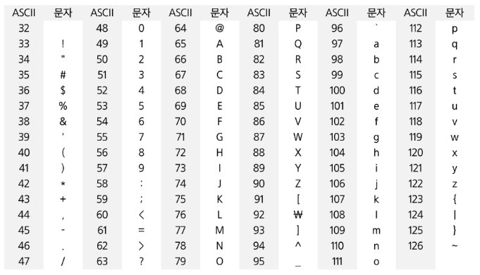
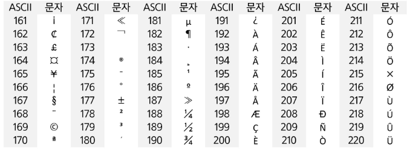
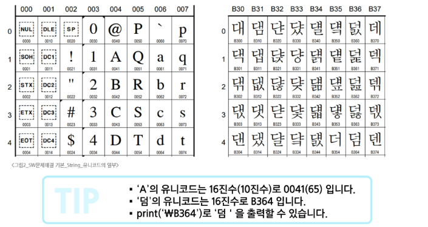
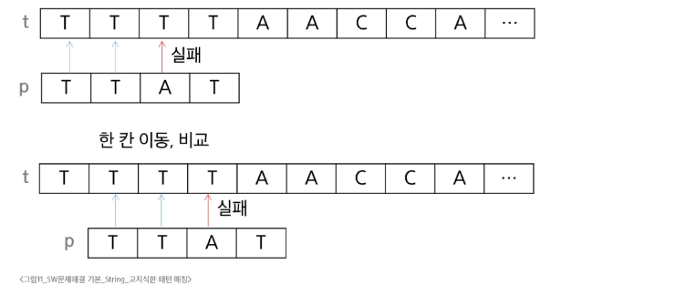

# 문자열

## 코드체계
- 문자에 대응되는 숫자를 정한 것
- 메모리에는 숫자만 저장할 수 있음 
- 문자는 이진수로 할당(알파벳은 대소문자 포함 52개 이므로 6bit로 배정)

### 코드체계 개선
- 지역별로 다른 코드체계 사용
- 혼동을 피하기 위해 표준안을 만듦
- 아스키 문자 사용
    - 확장 아스키
        - 표준 문자 이외의 악센트 문자, 도형 문자, 특수 문자, 특수 기호 등 부가적인 문자를 128개 추가
        - 표준 아스키는 7bit, 확장 아스키는 8bit



### 유니코드
- 각 국가들이 자국의 문자를 표현하기 위해 코드체계를 만들어서 사용
- 국가 사이 정보를 주고 받을 때 문제 발생
- 다국어 처리를 위해 표준인 유니코드 만듦


---
그냥 input() 이런거 얘기하는 듯
이론적인거
---

## 패턴 매칭
### 고지식한 패턴 검색
- 단순한 방법
- 본문 문자열을 처음부터 끝까지 차례대로 순회하면서 패턴 내의 문자들을 일일이 비교하는 방법
- 시간 복잡도 높음



```python
def brute_force(p, t): # p: 찾을 패턴, t: 본문 문자열, 패턴이 있으면 인덱스, 없으면 -1 리턴
    i = 0 # t의 인덱스
    j = 0 # p의 인덱스
    M = len(p)
    N = len(t)
    while j < M and i < N:
        if t[i] != p[j]: # 다른 글자인 경우
            i = i - j
            j = -1
        i += 1
        j += 1
    if j == M: 
        return i - M # 검색 성공
    else:
        return -1 # 검색 실패
```

### KMP 알고리즘
- 패턴의 각 위치에서 매칭에 실패했을 때 돌아갈 위치를 미리 계산
    - 불일치가 발생한 글자의 앞 부분에 어떤 문자가 있는지를 미리 앎
    - 조건에 따라 불일치가 발생한 앞 부분에 대하여 비교하지 않아도 됨
    - 불일치가 발생했을 경우 다음 위치를 계산하는 전처리 필요

```python
def compute_lps(pattern):
    """
    LPS (Longest Proper Prefix which is also Suffix) 배열 계산
    """
    m = len(pattern)
    lps = [0] * m
    length = 0  # 이전 LPS의 길이
    i = 1
    
    while i < m:
        if pattern[i] == pattern[length]:
            length += 1
            lps[i] = length
            i += 1
        else:
            if length != 0:
                length = lps[length - 1]
            else:
                lps[i] = 0
                i += 1
    
    return lps


def kmp_search(text, pattern):
    """
    KMP 알고리즘을 사용한 문자열 검색
    """
    n = len(text)
    m = len(pattern)
    
    # 실패 함수(LPS 배열) 계산
    lps = compute_lps(pattern)
    
    result = []  # 매칭된 위치들을 저장
    i = 0  # text의 인덱스
    j = 0  # pattern의 인덱스
    
    while i < n:
        if text[i] == pattern[j]:
            i += 1
            j += 1
        
        if j == m:
            # 패턴을 찾음
            result.append(i - j)
            j = lps[j - 1]
        elif i < n and text[i] != pattern[j]:
            # 불일치
            if j != 0:
                j = lps[j - 1]
            else:
                i += 1
    
    return result
```
### 보이어-무어 알고리즘
- 상용 소프트웨어에서 채택하고 있는 알고리즘
- 실제 검색에서 매우 빠른 성능
    - 패턴 오른쪽 끝에 있는 문자가 불일티하고 이 문자가 패턴 내에 존재하지 않는 경우, 이동거리는 패턴 길이만큼

```python
def build_bad_char_table(pattern):
    """
    Bad Character Table (Skip Table) 생성
    패턴 내 각 문자의 마지막 위치를 저장
    """
    table = {}
    m = len(pattern)
    
    # 모든 문자를 순회하며 마지막 등장 위치 기록
    for i in range(m):
        table[pattern[i]] = i
    
    return table


def boyer_moore_search(text, pattern):
    """
    보이어-무어 알고리즘으로 문자열 검색
    """
    n = len(text)
    m = len(pattern)
    
    if m == 0 or m > n:
        return []
    
    # Bad Character Table 생성
    bad_char = build_bad_char_table(pattern)
    
    result = []  # 매칭된 위치들
    s = 0  # 텍스트에서 패턴의 시작 위치
    
    while s <= n - m:
        j = m - 1  # 패턴의 끝에서부터 비교

        
        # 오른쪽에서 왼쪽으로 비교
        while j >= 0 and pattern[j] == text[s + j]:
            j -= 1
        
        if j < 0:
            # 패턴 발견!
            result.append(s)
            
            # 다음 패턴 위치로 이동
            if s + m < n:
                # 다음 문자를 기준으로 이동
                next_char = text[s + m]
                shift = m - bad_char.get(next_char, -1) - 1
            else:
                shift = 1
            s += max(1, shift)
        else:
            # 불일치 발생
            mismatch_char = text[s + j]

            # Bad Character Rule 적용
            if mismatch_char in bad_char:
                # 패턴 내에 해당 문자가 있는 경우
                shift = j - bad_char[mismatch_char]

            else:
                # 패턴 내에 해당 문자가 없는 경우
                shift = j + 1

            s += max(1, shift)
            print()
    
    return result
```

